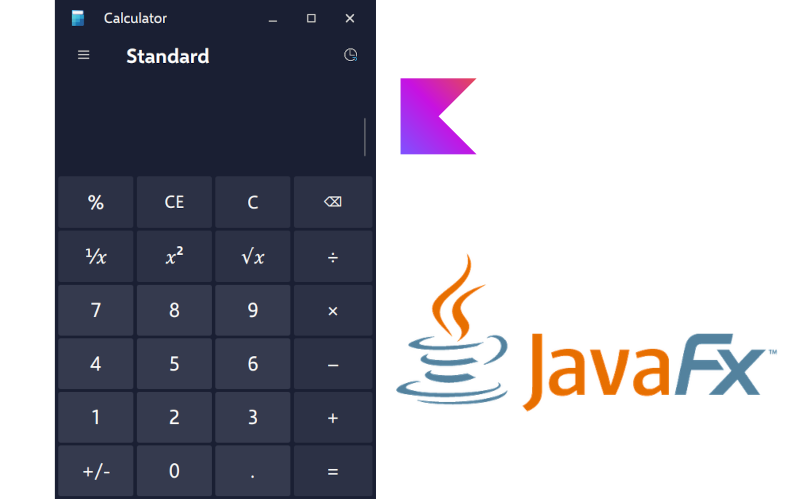

# AuroraCalc
### Clean, simple, and modern. Inspired by Windows 11’s "Mica" aesthetic.




AuroraCalc is a Windows 11-inspired calculator built with **Kotlin + JavaFX**, aiming to provide a sleek, modern, and minimalistic user experience. The goal is to faithfully recreate the look and feel of the native Windows 11 calculator while leveraging the power of JavaFX for cross-platform compatibility.

## 🚀 Current Status

- **Development Stage:** Mid-Development. The calculator works, but the history and menu functions are not yet implemented (currently working on this).
- **Functionality:** All operations are possible now. App buttons and keyboard as input work.
- **Usability:** At this stage, the calculator is functional developers and for end users (although it is limited to be a simple calculator).
- **Known bugs:** When using the buttons in the app all works fine (for instance, overwriting ^6 for ⁶ which is more eye-candy), but when using the keyboard as input... oh boi, I split open my head trying to remove the default behavior from the TextField when receiving numbers from 0-9 and handle it myself. It was... hard. Let's say keyboard input is handled well, but is not as polished as I planned it to be.

## 🎯 Features (Planned)

✅ **Windows 11-inspired UI** with a clean and modern design  
✅ **Smooth Animations** and aesthetic transitions  
✅ **Basic Arithmetic Operations** (+, -, ×, ÷)  
✅ **Scientific Functions** (trigonometry, logarithms, etc.)  
✅ **History & Memory Functions**  
✅ **Keyboard Shortcuts Support**  
✅ **Dark Mode / Theming Support** (by now, it only supports dark theme)

## 🛠️ Technologies Used

- **Kotlin** – Main programming language
- **JavaFX** – GUI framework
- **CSS** – Custom styling for modern aesthetics
- **FXML** – UI structure

## 📂 Project Structure
```
AuroraCalc/
├── src/main/kotlin/com/korealm/         # Kotlin source code
│   ├── Main.kt                           # Entry point of the app
│   ├── InitController.kt                 # Handles UI interactions
├── src/main/resources/com/korealm/      # UI resources
│   ├── main.fxml                          # UI layout
│   ├── styles/                            # CSS files
│   ├── icons/                             # Icons used in the app
├── README.md                             # This file
├── LICENSE                               # GPLv3 (GNU General Public License v3)
└── ...
```

## 🔧 How to Run

1. Clone the repository:
   ```sh
   git clone https://github.com/kosail/AuroraCalc.git
   cd AuroraCalc
   ```
2. Open the project in **IntelliJ IDEA** (recommended) or another IDE with Kotlin support. Just keep in mind that **this project does not use gradle or maven**. It was build with pure IntelliJ.
3. Run the `Main.kt` file to launch the application.

## 📌 Roadmap
- [ ] Finalize UI elements and layout
- [X] Implement core calculator logic
- [ ] Add scientific calculator functions
- [ ] Enhance UI with animations and better responsiveness
- [ ] Improve keyboard accessibility
- [ ] Optimize performance

## 🤝 Contributing
Contributions are welcome! Feel free to fork the repository and submit pull requests. If you have ideas, suggestions, or bug reports, open an issue on GitHub.

## 🎒 Resources
* Font: [Selawik](https://github.com/microsoft/Selawik), by Microsoft
* Icons: [Win11 Icon Theme](https://store.kde.org/p/1546069), by yeyushengfan258
* Libraries: [exp4j](https://www.objecthunter.net/exp4j/), by objecthunter


## 📜 License
[GPLv3 (GNU General Public License v3)](LICENSE.txt) – Free to use, modify, and distribute as long as this remains open source, and it is not use for profitable purposes.

---
> **Note:** AuroraCalc is a personal learning project and is not affiliated with Microsoft, Windows 11 or any other brand or product.

